# 🧹 Sistema di Pulizia Manuale Notifiche

## 📋 Panoramica

Il sistema di pulizia manuale delle notifiche permette agli amministratori di gestire la pulizia delle notifiche vecchie direttamente dall'interfaccia admin, senza bisogno di cron job automatici.

## 🎯 Caratteristiche

### ✅ Vantaggi
- **Controllo totale**: L'admin decide quando eseguire la pulizia
- **Visibilità completa**: Statistiche in tempo reale delle notifiche
- **Sicurezza**: Conferma prima dell'eliminazione
- **Simulazione**: Possibilità di vedere cosa verrà eliminato prima di procedere
- **Interfaccia intuitiva**: Integrato nella sezione admin notifiche

### 🔧 Componenti

#### 1. **Hook `useNotificationsCleanup`**
```typescript
// src/hooks/useNotificationsCleanup.tsx
const { loading, stats, getStats, dryRun, executeCleanup } = useNotificationsCleanup();
```

#### 2. **Componente `NotificationsCleanupButton`**
```typescript
// src/components/notifications/NotificationsCleanupButton.tsx
<NotificationsCleanupButton />
```

#### 3. **Edge Function `notifications-cleanup`**
```typescript
// supabase/functions/notifications-cleanup/index.ts
// Gestisce le operazioni di cleanup tramite API HTTP
```

## 🚀 Come Funziona

### 1. **Statistiche in Tempo Reale**
- **Totale Notifiche**: Numero totale di notifiche nel sistema
- **Da Eliminare**: Notifiche che superano il periodo di retention
- **Pulizia**: Percentuale di notifiche "pulite"
- **Ultimo Cleanup**: Data dell'ultimo cleanup eseguito

### 2. **Operazioni Disponibili**

#### 📊 **Aggiorna Statistiche**
- Ricarica le statistiche dal database
- Mostra lo stato attuale delle notifiche

#### 🧪 **Simula Pulizia (Dry Run)**
- Simula l'eliminazione senza rimuovere effettivamente i dati
- Mostra quanti record verrebbero eliminati
- **Sicuro**: Non modifica il database

#### 🗑️ **Esegui Pulizia**
- Elimina effettivamente le notifiche vecchie
- Richiede conferma prima dell'esecuzione
- Mostra dettagli di cosa verrà eliminato
- **Non reversibile**: I dati eliminati non possono essere recuperati

### 3. **Configurazione Retention**

Le regole di retention sono configurate nella tabella `cleanup_config`:

```sql
-- Esempio configurazione
INSERT INTO public.cleanup_config (table_name, retention_days, is_enabled) VALUES
  ('notifications', 90, true),        -- 90 giorni per notifiche
  ('sent_notifications', 365, true);  -- 365 giorni per notifiche inviate
```

## 🎮 Interfaccia Utente

### Dashboard Admin → Gestione Notifiche

Il pulsante di cleanup appare nella sezione **Gestione Notifiche** dell'admin con:

1. **Card di Statistiche**
   - Visualizzazione rapida dei numeri chiave
   - Indicatori visivi dello stato del sistema

2. **Pulsanti di Azione**
   - 🔄 **Aggiorna Statistiche**: Ricarica i dati
   - ⏱️ **Simula Pulizia**: Dry run senza modifiche
   - 🗑️ **Esegui Pulizia**: Eliminazione reale

3. **Dettagli Configurazione**
   - Lista delle tabelle configurate
   - Periodi di retention per ogni tabella
   - Stato abilitato/disabilitato
   - Statistiche dettagliate per tabella

### Dialog di Conferma

Prima dell'eliminazione reale:
- **Lista dettagliata** di cosa verrà eliminato
- **Conteggio record** per ogni tabella
- **Avviso di sicurezza** che l'operazione non è reversibile
- **Pulsanti** per confermare o annullare

## 🔄 Flusso di Lavoro

```mermaid
graph TD
    A[Admin accede alla sezione Notifiche] --> B[Visualizza statistiche attuali]
    B --> C{Vuole simulare?}
    C -->|Sì| D[Esegue Dry Run]
    C -->|No| E{Vuole pulire?}
    D --> F[Vede risultati simulazione]
    F --> E
    E -->|Sì| G[Conferma eliminazione]
    E -->|No| H[Fine]
    G --> I[Esegue cleanup reale]
    I --> J[Aggiorna statistiche]
    J --> K[Mostra risultati]
    K --> H
```



## 🛠️ Implementazione Tecnica

### Edge Function API

```typescript
// GET /functions/v1/notifications-cleanup
// - action: 'stats' (default)
// - dry_run: true/false (default: false)

// POST /functions/v1/notifications-cleanup
// - action: 'cleanup'
// - dry_run: true/false (default: false)
```

### Risposta API

```typescript
interface CleanupResponse {
  success: boolean;
  action: string;
  data?: {
    total_records_deleted: number;
    total_execution_time_ms: number;
    results: Array<{
      table_name: string;
      deleted_count: number;
      execution_time_ms: number;
      success: boolean;
    }>;
  };
  error?: string;
  timestamp: string;
}
```

## 🔒 Sicurezza

### Controlli di Accesso
- Solo utenti con ruolo admin possono accedere alla funzionalità
- Edge function protetta con autenticazione Supabase
- Conferma esplicita prima dell'eliminazione

### Validazioni
- Verifica dei parametri di input
- Controllo dell'esistenza delle tabelle
- Gestione errori completa
- Logging delle operazioni

## 📊 Monitoraggio

### Statistiche Disponibili
- **Totale record** per tabella
- **Record da eliminare** (oltre retention)
- **Ultima esecuzione** cleanup
- **Record eliminati** nell'ultimo cleanup
- **Tempo di esecuzione** delle operazioni

### Log e Tracciabilità
- Timestamp di ogni operazione
- Conteggi dettagliati per tabella
- Errori e messaggi di stato
- Performance metrics

## 🎯 Best Practices

### 1. **Workflow Consigliato**
1. **Controlla statistiche** regolarmente
2. **Esegui dry run** prima del cleanup reale
3. **Verifica risultati** della simulazione
4. **Esegui cleanup** solo se necessario
5. **Monitora performance** del sistema

### 2. **Configurazione Retention**
- **Notifiche**: 90 giorni (buon equilibrio)
- **Notifiche inviate**: 365 giorni (storico)
- **Aggiusta** in base alle esigenze aziendali

### 3. **Manutenzione**
- **Pulizia settimanale** per sistemi con alto volume
- **Pulizia mensile** per sistemi con volume normale
- **Monitora spazio** disco database

## 🚨 Troubleshooting

### Problemi Comuni

#### Edge Function Non Risponde
```bash
# Verifica deploy
supabase functions deploy notifications-cleanup

# Test diretto
curl -X GET "https://peejlpqmxueviclhjcrr.supabase.co/functions/v1/notifications-cleanup?action=stats"
```

#### Errori di Autenticazione
- Verifica le chiavi API nel file `.env`
- Controlla i permessi dell'utente admin
- Verifica la configurazione RLS

#### Statistiche Non Aggiornate
- Clicca "Aggiorna Statistiche"
- Verifica la connessione al database
- Controlla i log della edge function

## 📈 Prossimi Miglioramenti

### Funzionalità Future
- [ ] **Scheduling automatico** opzionale
- [ ] **Report email** dei cleanup
- [ ] **Backup** prima dell'eliminazione
- [ ] **Analytics** dettagliate
- [ ] **Export** delle statistiche

### Ottimizzazioni
- [ ] **Paginazione** per grandi dataset
- [ ] **Filtri avanzati** per le statistiche
- [ ] **Notifiche push** per cleanup completati
- [ ] **Dashboard** dedicata alle statistiche

---

## 🎉 Conclusione

Il sistema di pulizia manuale offre un controllo completo e una gestione sicura delle notifiche vecchie, con un'interfaccia intuitiva e funzionalità avanzate di monitoraggio e sicurezza.

**Per iniziare**: Accedi alla sezione **Gestione Notifiche** come admin e utilizza il pulsante **Pulizia Notifiche** per gestire il cleanup del sistema.
